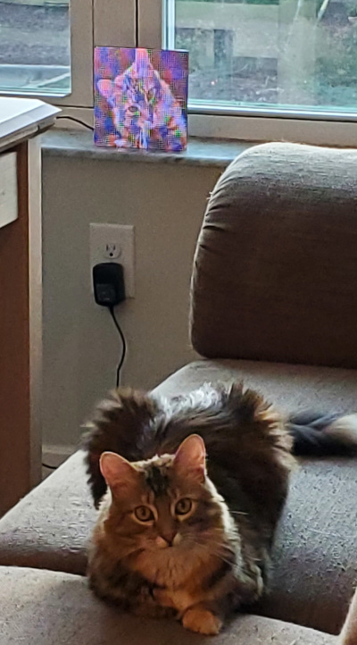
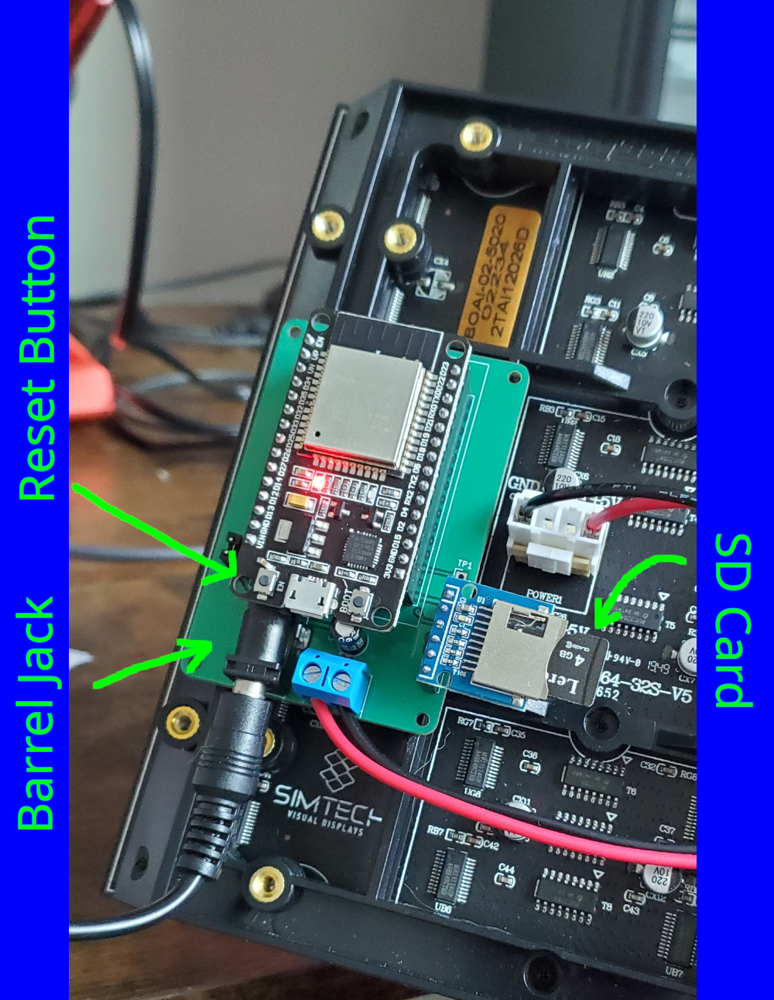
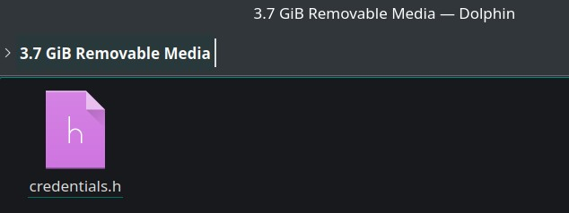
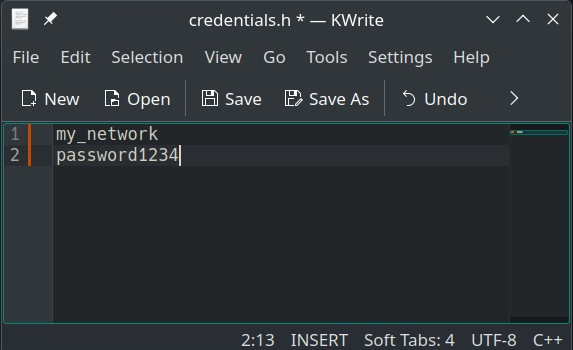
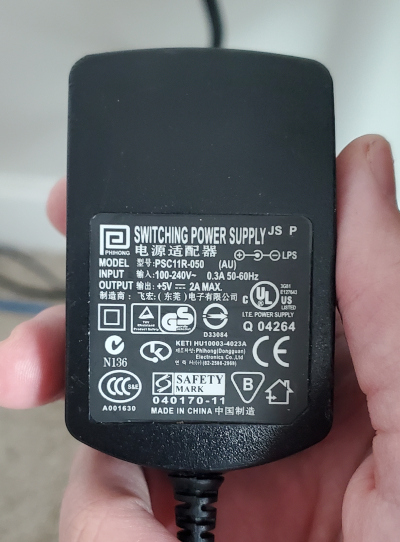
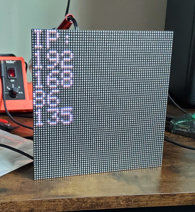
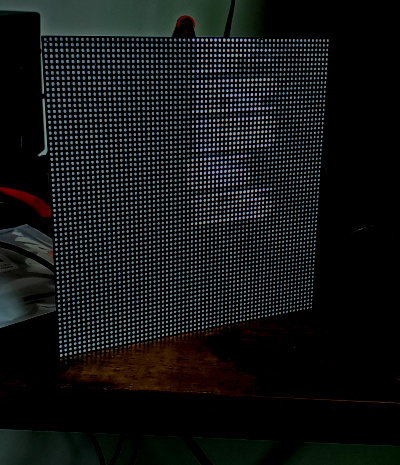
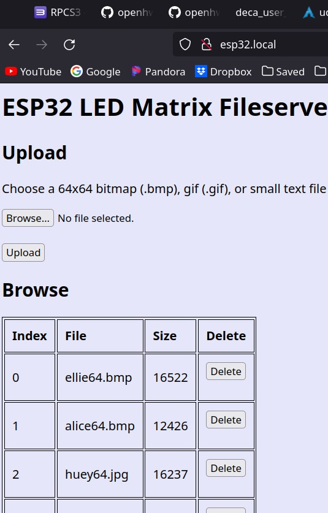
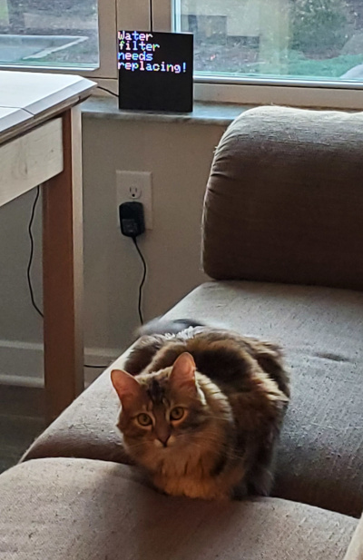

# ESP32 LED Matrix Fileserver

Upload images, gifs, and text files for display on an LED matrix!

|  |
| :--: |
| *Cat* |

The board consists of an ESP32 microcontroller and an SD card.
The SD card can be accessed remotely through a web browser, after some setup is complete.

|  |
| :--: |
| *ESP32 Board* |

## Setup Steps

### 1. Network Credentials

Remove the microSD card from the ESP32 board and insert it into a disk reader on your PC. 
Create a file called "credentials.h", or open it if it already exists.

|  |
| :--: |
| *Mounted SD card* |

Open the file in a text editor and input your network SSID and password on consecutive lines.

|  |
| :--: |
| *Credentials* |

Place the SD card back into the ESP32 board.

### 2. Power

Plug the onboard barrel-jack into a 5V DC power supply.
Anything at or above 5V-1A will work:

|  |
| :--: |
| *Example Power Supply* |

### 3. Webserver

After plugging in the board with the network credentials loaded, the ESP32 will connect to your home network.
The IP address of the ESP32 will be displayed on the LED matrix, like this:

|  |
| :--: |
| *Displayed IP* |

Note:
If the IP address is displayed is shifted and blurry, reapply power to the board or press the reset button.

|  |
| :--: |
| *Screen malfunction, reset!* |

In your web broswer, enter the IP address, eg:
```
http://192.168.86.135
```

You may be able to connect using mDNS, instead of the IP address: 
```
esp32.local
```

If that doesn't work, you need install an mDNS service like Bonjour (Windows)

### 4. Upload Images

If the previous steps worked, you'll be able to access the fileserver:

|  |
| :--: |
| *File Server* |

The images/gifs you upload must be 64x64 in size, and text files will wrap around as needed.
The accepted file formats are:
* .txt
* .bmp
* .gif

|  |
| :--: |
| *Telepathy* |


